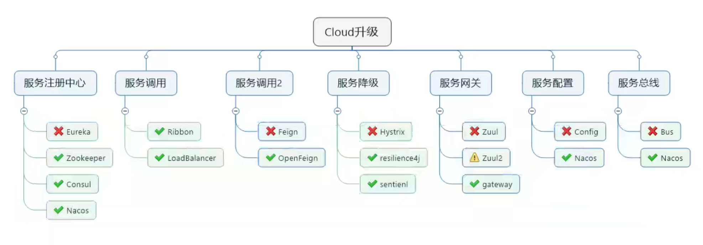
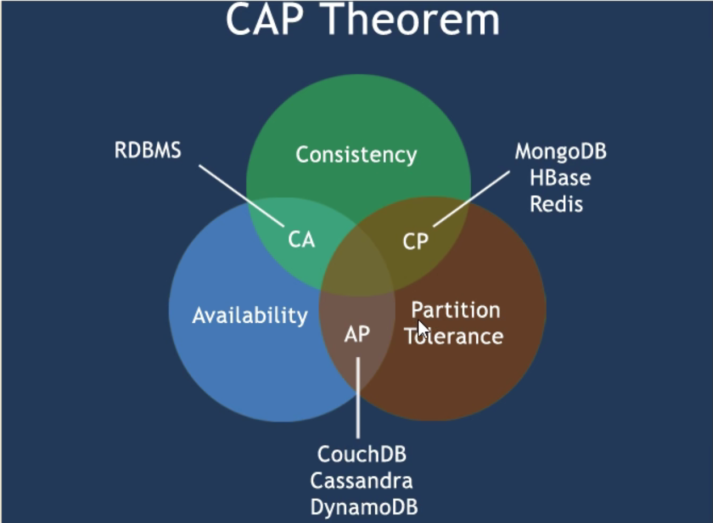
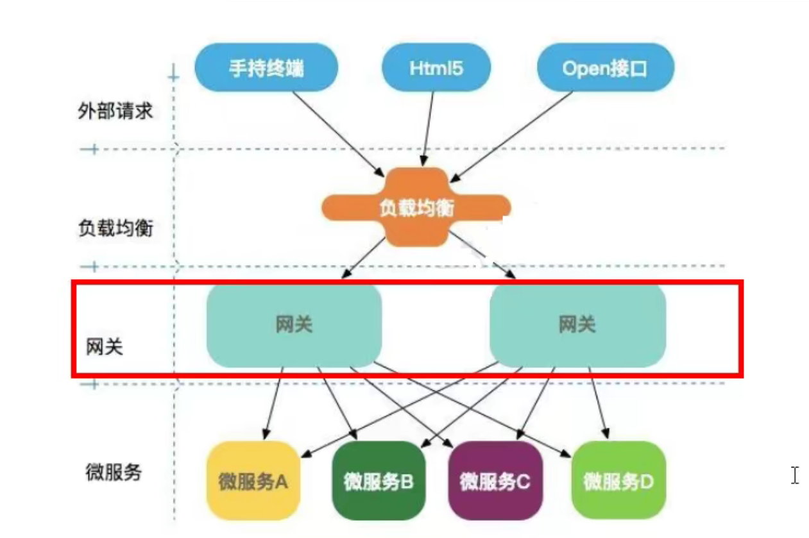

# SpringCloud-Study

## 一、Cloud升级

**CAP**

- C 一致性(Consistency)
- A 可用性(Availability)
- P 分区容错性(Partition tolerance)

**CAP理论核心：一个分布式系统不可能同时很好的满足一致性、可用性和分区容错性三个需求。**

**经典CAP图**

### 1、服务注册与发现

#### 1.1 Eureka服务注册与发现（AP）

**Eureka集群**

- cloud-eureka-server7001
- cloud-eureka-server7002
- cloud-eureka-server7003

**服务集群**

- cloud-provider-payment8001
- cloud-provider-payment8002

**消费者**

- cloud-consumer-order80

#### 1.2 Zookeeper服务注册与发现（CP）

- cloud-provider-payment8004
- cloud-consumerzk-order80

#### 1.3 Consul服务注册与发现（CP）

**[Consul下载](https://www.consul.io/downloads)**

**[Consul使用教程](https://blog.csdn.net/qq_31236849/article/details/119829213?spm=1001.2101.3001.6661.1&utm_medium=distribute.pc_relevant_t0.none-task-blog-2%7Edefault%7ECTRLIST%7Edefault-1.opensearchhbase&depth_1-utm_source=distribute.pc_relevant_t0.none-task-blog-2%7Edefault%7ECTRLIST%7Edefault-1.opensearchhbase)**

- cloud-provider-payment8005
- cloud-consumerconsul-order80

### 2、服务调用

#### 2.1 Rabbion服务调用负载均衡

#### 2.2 OpenFeign服务调用

**Eureka集群**

- cloud-eureka-server7001
- cloud-eureka-server7002
- cloud-eureka-server7003

**服务集群**

- cloud-provider-payment8001
- cloud-provider-payment8002

**消费者**

- cloud-consumer-feign-order80

### 3、服务降级

#### 3.1 Hystrix

- cloud-eureka-server-stand-alone7001
- cloud-provider-hystrix-payment8001
- cloud-consumer-feign-hystrix-order80

### 4、服务网关

- 反向代理
- 鉴权
- 流量控制
- 熔断
- 日志监控
- ......

#### 4.1 Zuul

已经过时不再使用，已被Gateway替代。

#### 4.2 Gateway

GateWay是SpringCloud团队研发的，基于异步非阻塞模型上进行开发的，性能不需要担心。

项目：

- cloud-eureka-server7001
- cloud-eureka-server7002
- cloud-eureka-server7003
- cloud-provider-payment8001
- cloud-provider-payment8002
- cloud-gateway-gateway9527

