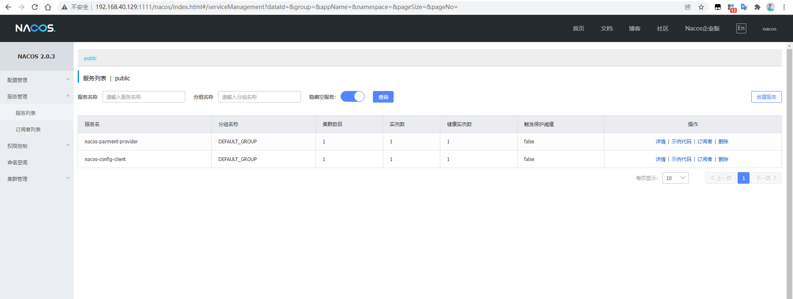

# 服务配置 Nacos Config

**[Nacos config教程](https://github.com/alibaba/spring-cloud-alibaba/wiki/Nacos-config)**

### 可支持profile粒度的配置（注意）

spring-cloud-starter-alibaba-nacos-config 在加载配置的时候，不仅仅加载了以 dataid 为 `${spring.application.name}.${file-extension:properties}` 为前缀的基础配置，还加载了dataid为 `${spring.application.name}-${profile}.${file-extension:properties}` 的基础配置。在日常开发中如果遇到多套环境下的不同配置，可以通过Spring 提供的 `${spring.profiles.active}` 这个配置项来配置。


## Linux 搭建高可用的Nacos集群


### 1、Nginx配置

nginx.conf

```
    upstream clusternacos{
        server 127.0.0.1:3333;
        server 127.0.0.1:4444;
        server 127.0.0.1:5555;
    }
    server {
        listen       1111;
        server_name  localhost;

        location / {
        	proxy_pass http://clusternacos;
        }
    }

```

### 2、Nacos集群

搭建3个Nacos服务器，分别为3333,4444,5555

conf/cluster.conf配置

```
192.168.40.129:3333
192.168.40.129:4444
192.168.40.129:5555
```

conf/applicaton.properties配置

```
#将原先的8848端口修改3333/4444/5555
server.port=3333 
# mysql配置信息
spring.datasource.platform=mysql

db.num=1
db.url.0=jdbc:mysql://127.0.0.1:3306/nacos_config?serverTimezone=GMT%2B8&characterEncoding=utf8&connectTimeout=1000&socketTimeout=3000&autoReconnect=true
db.user=root
db.password=123456

```

#### 3、配置完毕后访问http://192.168.40.129:1111/nacos/index.html



