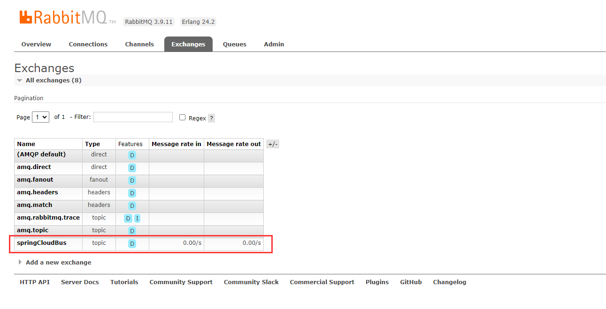
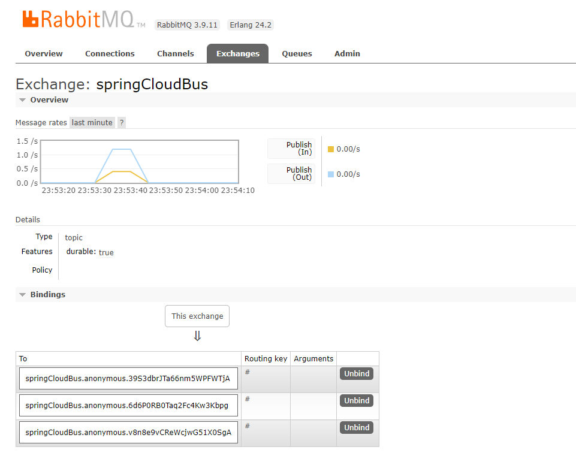

# Spring Cloud Config

**[Github地址：spring-cloud/spring-cloud-config](https://github.com/spring-cloud/spring-cloud-config)**

**[官网：Spring Cloud Config](https://docs.spring.io/spring-cloud-config/docs/current/reference/html/)**

## 配置中心

### 1、引入依赖

```xml
 		<dependency>
            <groupId>org.springframework.cloud</groupId>
            <artifactId>spring-cloud-config-server</artifactId>
        </dependency>
```

### 2、applicatiom配置

```
server:
  port: 3344

spring:
  application:
    name: cloud-config-client
  cloud:
    config:
      server:
        git:
          # 访问http://localhost:3344/YondFane/SpringCloud-Study/main/config-dev.yml
          # 访问http://localhost:3344/config-dev.yml 与上面等效
          # http://localhost:3344/config/dev/main
          uri: https://gitee.com/YondFane/SpringCloud-Study #git@github.com:YondFane/SpringCloud-Study.git # github的git仓库名字
          ## 搜索目录
          search-paths:
            - ProjectConfig
          default-label: main #分支
      label: main


eureka:
  client:
    service-url:
      defaultZone: http://localhost:7001/eureka

```

## 客户端

### 1、引入依赖

**客户端使用的是bootstrap.yml，需要引入spring-cloud-starter-bootstrap**

```
        <!-- 不引入此依赖bootstrap.yml不生效 -->
        <dependency>
            <groupId>org.springframework.cloud</groupId>
            <artifactId>spring-cloud-starter-bootstrap</artifactId>
        </dependency>
        <dependency>
            <groupId>org.springframework.cloud</groupId>
            <artifactId>spring-cloud-starter-config</artifactId>
        </dependency>
```

### 2、bootstrap.yml配置

```
server:
  port: 3355

spring:
  application:
    name: cloud-config-center
  cloud:
    # Config客户端配置
    config:
      label: main #分支名称
      name: config #配置文件名称
      profile: dev #读取后缀名称
      uri: http://localhost:3344 #配置中心地址


eureka:
  client:
    service-url:
      defaultZone: http://localhost:7001/eureka

# 暴露监控端点 actuator/*
management:
  endpoints:
    web:
      exposure:
        include: "*"

```

### 3、控制类

需要添加@RefreshScope注解

```java
@RestController
@Slf4j
@RefreshScope // 运行时刷新
public class ConfigClientController {

    // 获取config-dev.yml中的test属性值
    @Value("${test}")
    private String configInfo;

    @GetMapping("/configInfo")
    public String getConfigInfo() {
        log.info("configInfo:{}", configInfo);
        return configInfo;
    }

}
```

## 测试

在启动配置中心、客户端后，在对应的git仓库修改conifg-dev.yml的内容提交后，使用Post请求访问http://localhost:3355/actuator/refresh**手动**刷新配置信息，即可获取到最新的conifg-dev.yml配置内容。


# Spring Cloud Bus

**[Github地址：spring-cloud/spring-cloud-bus](https://github.com/spring-cloud/spring-cloud-bus)**

**[官网：Spring Cloud Bus](https://docs.spring.io/spring-cloud-bus/docs/current/reference/html/)**

## 配置中心

### 1、引入依赖

```xml
        <!-- 添加消息总线RabbitMQ支持 -->
        <dependency>
            <groupId>org.springframework.cloud</groupId>
            <artifactId>spring-cloud-starter-bus-amqp</artifactId>
        </dependency>
```

### 2、application.yml配置

```
server:
  port: 3344

spring:
  application:
    name: cloud-config-client
  cloud:
    config:
      server:
        git:
          # 访问http://localhost:3344/YondFane/SpringCloud-Study/main/config-dev.yml
          # 访问http://localhost:3344/config-dev.yml 与上面等效
          # http://localhost:3344/config/dev/main
          uri: https://gitee.com/YondFane/SpringCloud-Study #git@github.com:YondFane/SpringCloud-Study.git # github的git仓库名字
          ## 搜索目录
          search-paths:
            - ProjectConfig
          default-label: main #分支
      label: main
  # rabbitmq配置
  rabbitmq:
    host: localhost
    port: 5672
    username: admin
    password: admin


eureka:
  client:
    service-url:
      defaultZone: http://localhost:7001/eureka

#暴露bus刷新配置的端点
management:
  endpoints:
    web:
      exposure:
        include: 'bus-refresh'

```

## 客户端

### 1、引入依赖

```xml
        <!-- 添加消息总线RabbitMQ支持 -->
        <dependency>
            <groupId>org.springframework.cloud</groupId>
            <artifactId>spring-cloud-starter-bus-amqp</artifactId>
        </dependency>
```

### 2、bootstrap.yml配置

```
server:
  port: 3366

spring:
  application:
    name: cloud-config-center
  cloud:
    # Config客户端配置
    config:
      label: main #分支名称
      name: config #配置文件名称
      profile: dev #读取后缀名称
      uri: http://localhost:3344 #配置中心地址
  # rabbitmq配置
  rabbitmq:
    host: localhost
    port: 5672
    username: admin
    password: admin

eureka:
  client:
    service-url:
      defaultZone: http://localhost:7001/eureka

# 暴露监控端点
management:
  endpoints:
    web:
      exposure:
        include: "*"

```

## 测试

1、启动配置中心cloud-config-center3344

2、启动客户端cloud-config-client3355、cloud-config-client3366。

3、在对应的git仓库修改conifg-dev.yml的内容提交。

4、使用Post请求访问http://localhost:3344/actuator/busrefresh，配置中心会通知客户端们刷新配置信息。

5、访问http://localhost:3355/configInfo、http://localhost:3366/configInfo即可获取到最新的配置信息。

一次修改，广播通知，处处生效。

## 定点通知

POST请求访问 http://localhost:3344/actuator/busrefresh/{destination}

例如：http://localhost:3344/actuator/busrefresh/cloud-config-client:3355，那么配置中心就只广播到cloud-config-client3355客户端让它刷新配置信息。


## 过程

**RabbitMQ中新增了SpringCloudBus交换机**



**SpringCloudBus绑定的队列**



Post请求访问http://localhost:3344/actuator/busrefresh时，SpringCloudBus交换机给绑定的队列发送消息，客户端获取对应队列的消息后刷新配置信息。
