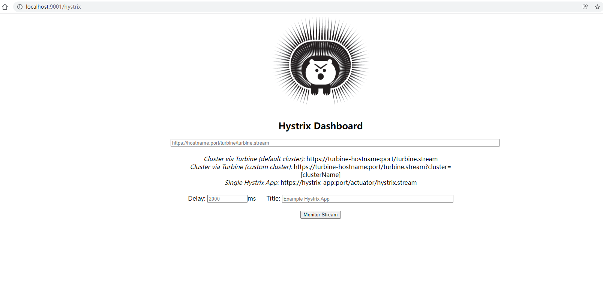
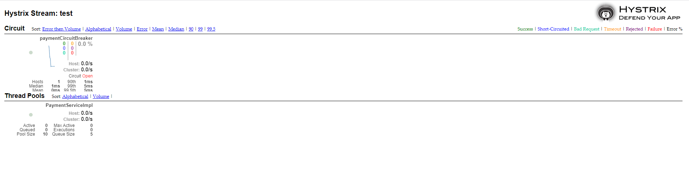

# Hystrix Dashboard 仪表盘

### 1、引入主要依赖

```html
		<!--Hystrix Dashboard监控仪表盘-->
        <dependency>
            <groupId>org.springframework.cloud</groupId>
            <artifactId>spring-cloud-starter-netflix-hystrix-dashboard</artifactId>
            <version>2.2.10.RELEASE</version>
        </dependency>
		<!--监控方和被监控方都需要引入-->
        <dependency>
            <groupId>org.springframework.boot</groupId>
            <artifactId>spring-boot-starter-actuator</artifactId>
        </dependency>
```

### 2、启动类@EnableHystrixDashboard

开启HystrixDashboard仪表盘

```java
@SpringBootApplication
@EnableHystrixDashboard// 开启HystrixDashboard仪表盘
public class DashBoardMain9001 {
    public static void main(String[] args) {
        SpringApplication.run(DashBoardMain9001.class, args);
    }
}
```

**新版本 Hystrix `需要在主启动类中指定监控路径`，如果没有此项操作，在项目启动后，Hystrix Dashboard 会报: `Unable to connect to Command Metric Stream` 这样一个错误**

```java
    //在被监控方主启动类中指定监控路径
    @Bean
    public ServletRegistrationBean getServlet(){
        HystrixMetricsStreamServlet streamServlet = new HystrixMetricsStreamServlet();
        ServletRegistrationBean registrationBean = new ServletRegistrationBean(streamServlet);
        registrationBean.setLoadOnStartup(1);
        registrationBean.addUrlMappings("/hystrix.stream");
        registrationBean.setName("HystrixMetricsStreamServlet");
        return registrationBean;
    }
```

### 3、访问监控页面

**http://localhost:9001/hystrix**



在监控页面中输入http://localhost:8001/hystrix.stream 



