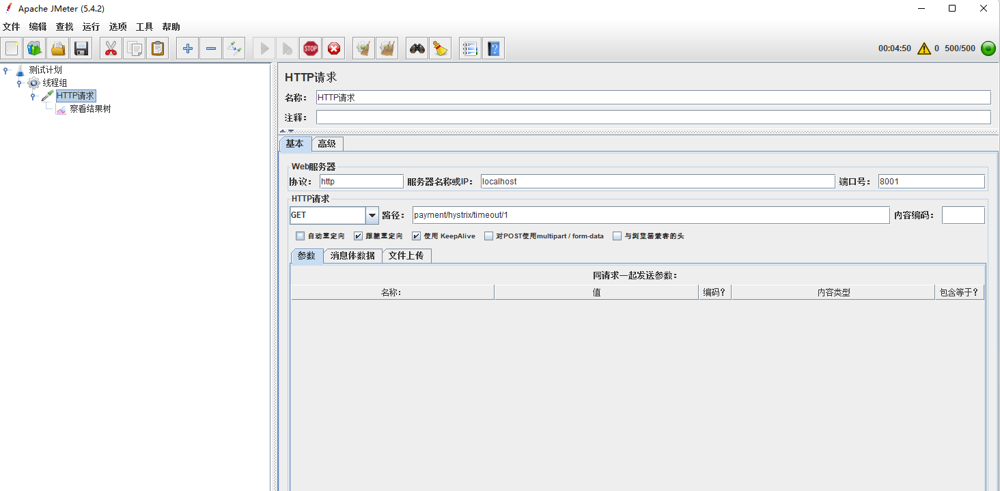

# Hystrix

Github地址：https://github.com/Netflix/Hystrix

## Hystrix工作流程

1. [构造`HystrixCommand`或`HystrixObservableCommand`对象](https://github.com/Netflix/Hystrix/wiki/How-it-Works#flow1)
2. [执行命令](https://github.com/Netflix/Hystrix/wiki/How-it-Works#flow2)
3. [响应是否已缓存？](https://github.com/Netflix/Hystrix/wiki/How-it-Works#flow3)
4. [电路是否打开？](https://github.com/Netflix/Hystrix/wiki/How-it-Works#flow4)
5. [线程池/队列/信号量是否已满？](https://github.com/Netflix/Hystrix/wiki/How-it-Works#flow5)
6. [`HystrixObservableCommand.construct（）`或`HystrixCommand.run（）`](https://github.com/Netflix/Hystrix/wiki/How-it-Works#flow6)
7. [计算电路运行状况](https://github.com/Netflix/Hystrix/wiki/How-it-Works#flow7)
8. [获取后备方案](https://github.com/Netflix/Hystrix/wiki/How-it-Works#flow8)
9. [返回成功的响应](https://github.com/Netflix/Hystrix/wiki/How-it-Works#flow9)

### 1. 构造一个或对象`HystrixCommand``HystrixObservableCommand`

第一步是构造一个 或 对象来表示您对依赖项发出的请求。向构造函数传递发出请求时所需的任何参数。`HystrixCommand``HystrixObservableCommand`

构造一个[`HystrixCommand`](http://netflix.github.com/Hystrix/javadoc/index.html?com/netflix/hystrix/HystrixCommand.html)对象（如果依赖项预期返回单个响应）。例如：

```
HystrixCommand command = new HystrixCommand(arg1, arg2);
```

构造一个[`HystrixObservableCommand`](http://netflix.github.com/Hystrix/javadoc/index.html?com/netflix/hystrix/HystrixObservableCommand.html)对象（如果依赖项预期返回发出响应的 Observable）。例如：

```
HystrixObservableCommand command = new HystrixObservableCommand(arg1, arg2);
```


### 2. 执行命令

有四种方法可以执行命令，方法是使用 Hystrix 命令对象的以下四种方法之一（前两种方法仅适用于简单对象，不适用于）：`HystrixCommand``HystrixObservableCommand`

- [`execute（）` ](http://netflix.github.io/Hystrix/javadoc/com/netflix/hystrix/HystrixCommand.html#execute())— 块，然后返回从依赖项收到的单个响应（或在发生错误时引发异常）
- [`queue（）` ](http://netflix.github.io/Hystrix/javadoc/com/netflix/hystrix/HystrixCommand.html#queue())— 返回 a，通过该值，您可以从依赖项获取单个响应`Future`
- [`observe（）` ](http://netflix.github.io/Hystrix/javadoc/com/netflix/hystrix/HystrixObservableCommand.html#observe())— 订阅表示依赖项中响应的 the，并返回复制该源的`Observable``Observable``Observable`
- [`toObservable（）` ](http://netflix.github.io/Hystrix/javadoc/com/netflix/hystrix/HystrixObservableCommand.html#toObservable())— 返回一个，当您订阅它时，它将执行 Hystrix 命令并发出其响应`Observable`

```
K             value   = command.execute();
Future<K>     fValue  = command.queue();
Observable<K> ohValue = command.observe();         //hot observable
Observable<K> ocValue = command.toObservable();    //cold observable
```

同步调用调用 。 反过来调用 .也就是说，最终每个命令都由[`可观察的`](http://reactivex.io/documentation/observable.html)实现提供支持，即使是那些旨在返回单个简单值的命令。`execute()``queue().get()``queue()``toObservable().toBlocking().toFuture()``HystrixCommand`


### 3. 响应是否已缓存？

如果为此命令启用了请求缓存，并且对请求的响应在缓存中可用，则此缓存的响应将立即以 的形式返回。（请参阅下面的["请求缓存"。](https://github.com/Netflix/Hystrix/wiki/How-it-Works#RequestCaching)`Observable`


### 4. 电路是否开放？

执行该命令时，Hystrix 会检查断路器以查看电路是否开路。

如果电路处于打开状态（或"跳闸"），则 Hystrix 将不会执行该命令，而是将流路由到 （8） 获取回退。

如果电路关闭，则流继续到（5）以检查是否有可用容量来运行命令。


### 5. 线程池/队列/信号量是否已满？

如果与该命令关联的线程池和队列（或信号量，如果未在线程中运行）已满，则 Hystrix 将不会执行该命令，但会立即将流路由到 （8） 获取回退。


### 6. 或`HystrixObservableCommand.construct()``HystrixCommand.run()`

在这里，Hystrix 通过您为此目的编写的方法调用对依赖项的请求，该方法之一如下：

- [`HystrixCommand.run（）` ](http://netflix.github.io/Hystrix/javadoc/com/netflix/hystrix/HystrixCommand.html#run())— 返回单个响应或引发异常
- [`HystrixObservableCommand.construct（）` ](http://netflix.github.io/Hystrix/javadoc/com/netflix/hystrix/HystrixObservableCommand.html#construct())— 返回发出响应或发送通知的 Observable`onError`

如果 or 方法超过命令的超时值，则线程将引发一个（或者，如果命令本身未在其自己的线程中运行，则会引发单独的计时器线程）。在这种情况下，Hystrix 将响应路由到 8。获取回退，如果该方法未取消/中断，它将丢弃最终的返回值或方法。`run()``construct()``TimeoutException``run()``construct()`

请注意，没有办法强制潜在线程停止工作 - Hystrix在JVM上可以做的最好的事情就是给它一个InterruptedException。如果 Hystrix 包装的工作不遵守中断异常，则 Hystrix 线程池中的线程将继续其工作，尽管客户端已收到超时异常。此行为可能会使 Hystrix 线程池饱和，尽管负载已"正确卸除"。大多数 Java HTTP 客户端库不解释中断异常。因此，请确保在 HTTP 客户端上正确配置连接和读/写超时。

如果该命令没有引发任何异常并返回响应，则 Hystrix 会在执行一些日志记录和指标报告后返回此响应。在 的情况下，Hystrix 返回一个发出单个响应，然后发出通知;在 Hystrix 的情况下，返回的相同。`run()``Observable``onCompleted``construct()``Observable``construct()`


### 7. 计算电路运行状况

Hystrix 向断路器报告成功、失败、拒绝和超时，断路器维护一组计算统计信息的滚动计数器。

它使用这些统计信息来确定电路何时应该"跳闸"，此时它会使任何后续请求短路，直到恢复期过去，在恢复期过后再次关闭电路。


### 8. 获取后备方案

Hystrix 尝试在命令执行失败时恢复回退：当 或 （6. ） 引发异常时，当命令因电路打开而短路时 （4.），当命令的线程池和队列或信号量达到容量时 （5.），或者当命令已超过其超时长度时。`construct()``run()`

编写回退以从内存中缓存或通过其他静态逻辑提供通用响应，而无需任何网络依赖关系。*如果在回退中必须使用网络调用，则应通过另一个`HystrixCommand`或`HystrixObservableCommand 来`执行此操作。*

对于 ，为了提供回退逻辑，您可以实现[`HystrixCommand.getFallback（），`](http://netflix.github.io/Hystrix/javadoc/com/netflix/hystrix/HystrixCommand.html#getFallback())它返回一个回退值。`HystrixCommand`

对于 提供回退逻辑，您可以实现[`HystrixObservableCommand.resumeWithFallback（），`](http://netflix.github.io/Hystrix/javadoc/com/netflix/hystrix/HystrixObservableCommand.html#resumeWithFallback())它返回一个 Observable，该可观察值可能会发出一个或多个回退值。`HystrixObservableCommand`

如果回退方法返回响应，则 Hystrix 会将此响应返回给调用方。在 的情况下，它将返回一个可观察量，该可观察量发出从该方法返回的值。在这种情况下，它将返回从该方法返回的相同的可观察量。`HystrixCommand.getFallback()``HystrixObservableCommand.resumeWithFallback()`

如果您尚未为 Hystrix 命令实现回退方法，或者如果回退本身引发异常，则 Hystrix 仍会返回一个 Observable，但该方法不发出任何信息，并立即终止并发出通知。正是通过此通知，导致命令失败的异常将传输回调用方。（实现可能失败的回退实现是一种糟糕的做法。您应该实现回退，使其不执行任何可能失败的逻辑。`onError``onError`

失败或不存在的回退的结果将有所不同，具体取决于您调用 Hystrix 命令的方式：

- `execute()`— 引发异常
- `queue()`— 成功返回 一个 ，但如果调用其方法，这将引发异常`Future``Future``get()`
- `observe()`— 返回一个，当您订阅它时，将通过调用订阅者的方法立即终止`Observable``onError`
- `toObservable()`— 返回一个，当您订阅它时，将通过调用订阅者的方法终止`Observable``onError`


### 9. 返回成功响应

如果 Hystrix 命令成功，它将以 .根据您在上述步骤 2 中调用命令的方式，在将其返回给您之前，可能会对其进行转换：`Observable``Observable`

[ *（点击查看大图）*](https://github.com/Netflix/Hystrix/wiki/images/hystrix-return-flow.png)

- `execute()`— 以与获取相同的方式获取 a，然后调用它来获得`Future``.queue()``get()``Future``Observable`
- `queue()`— 将 转换为 a 以便可以将其转换为 ，然后返回`Observable``BlockingObservable``Future``Future`
- `observe()`— 立即订阅并开始执行命令的流程;返回一个，当您到它时，将重播排放和通知`Observable``Observable``subscribe`
- `toObservable()`— 返回未更改的;您必须使用它才能实际开始导致执行命令的流程`Observable``subscribe`


## JMeter高并发测试

**使用JMeter高并发访问/payment/hystrix/timeout/1**




浏览器访问**服务端**/payment/hystrix/ok/1或/payment/hystrix/timeout/1，**响应缓慢**。

## 解决方法

### 1、服务降级

服务降级是当服务器压力剧增的情况下，根据当前业务情况及流量对一些服务和页面有策略的降级，以此释放服务器资源以保证核心任务的正常运行。

#### 1.1 服务端-业务类启用@HystrixCommand报异常后处理

```java
    @HystrixCommand(fallbackMethod = "paymentInfoTimeOutHandler", commandProperties = {
            // 调用超时时间，超时后调用fallbackMethod指定的方法
            @HystrixProperty(name = "execution.isolation.thread.timeoutInMilliseconds", value = "3000")
    })
    @Override
    public String paymentInfoTimeOut(Long id) {
        long time = 5;
        try {
            // 休眠
            TimeUnit.SECONDS.sleep(time);
        } catch (InterruptedException e) {
            log.info(e.getMessage());
        }
        return "线程池：" + Thread.currentThread().getName() + " paymentInfoTimeOut,id: " + id
                + "\t耗时" + time + "秒";
    }
    // 调用超时处理方法
    public String paymentInfoTimeOutHandler(Long id) {
        return "线程池：" + Thread.currentThread().getName() + " paymentInfoTimeOutHandler,id: "
                + id + "/t系统繁忙，请稍后再试";
    }
```

**低版本的Hystrix需要在启动类加@EnableCircuitBreaker注解**

#### 1.2 客户端-控制类启用@HystrixCommand报异常后处理

```java
    @HystrixCommand(fallbackMethod = "paymentInfoTimeOutHandler", commandProperties = {
            // 调用超时时间，超时后调用fallbackMethod指定的方法
            @HystrixProperty(name = "execution.isolation.thread.timeoutInMilliseconds", value = "2000")
    })
    @GetMapping("/consumer/payment/hystrix/timeout/{id}")
    public String paymentInfoError(@PathVariable("id") Long id) {
        String result = paymentHystrixService.paymentInfoTimeOut(id);
        log.info("consumer-paymentInfoError:{}", result);
        return "consumer-" + result;
    }

    // 调用超时处理方法
    public String paymentInfoTimeOutHandler(@PathVariable("id") Long id) {
        return "consumer:payment服务系统繁忙，请稍后再试！";
    }
```

#### **1.3 全局fallback处理**

@DefaultProperties配置全局处理fallback方法

**@HystrixCommand如果配置fallbackMethod则执行当前fallbackMethod，不执行全局fallback**

```
// 定义全局fallback方法
@DefaultProperties(defaultFallback = "paymentGlobalHandler")
public class PaymentServiceImpl implements PaymentService {
...
...
...
	  // @HystrixCommand如果配置fallbackMethod则执行当前fallbackMethod
//    @HystrixCommand(fallbackMethod = "paymentInfoTimeOutHandler", commandProperties = {
//            // 调用超时时间，超时后调用fallbackMethod指定的方法
//            @HystrixProperty(name = "execution.isolation.thread.timeoutInMilliseconds", value = "5000")
//    })
    @HystrixCommand
    @Override
    public String paymentInfoTimeOut(Long id) {
        long time = 3;
        int i = 1/0;
        try {
            // 休眠
            TimeUnit.SECONDS.sleep(time);
        } catch (InterruptedException e) {
            log.info(e.getMessage());
        }
        return "线程池：" + Thread.currentThread().getName() + " paymentInfoTimeOut,id: " + id
                + "\t耗时" + time + "秒";
    }
    // 调用超时处理方法
    public String paymentInfoTimeOutHandler(Long id) {
        return "线程池：" + Thread.currentThread().getName() + " paymentInfoTimeOutHandler,id: "
                + id + "/t系统繁忙，请稍后再试";
    }

    /*
     * 全局处理方法
     * @author YFAN
     * @date 2021/12/26/026
     */
    public String paymentGlobalHandler() {
        return "线程池：" + Thread.currentThread().getName() + " paymentGlobalHandler, "
                 + "/t系统繁忙，请稍后再试";
    }
}
```


### 2、服务熔断

**熔断机制**是应对服务雪崩效应的一种微服务链路保护机制，当扇出链路的某个微服务不可用或者响应时间太长时，会进行服务的降级，进而熔断该节点微服务的调用，快速返回”错误”的响应信息。当检测到该节点微服务响应正常后恢复调用链路，在SpringCloud框架机制通过Hystrix实现，Hystrix会监控微服务见调用的状况，当失败的调用到一个阈值，缺省是5秒内20次调用失败就会启动熔断机制，熔断机制的注解是@HystrixCommand。

```java
    /*
     * 服务熔断
     * 10000ms内请求次数达到10次且超过60%失败触发断路器
     * @author YFAN
     * @date 2021/12/27/027
     */
    @HystrixCommand(fallbackMethod = "paymentCircuitBreakerFallback", commandProperties = {
            // 开启断路器
            @HystrixProperty(name="circuitBreaker.enabled", value = "true"),
            // 请求次数
            @HystrixProperty(name="circuitBreaker.requestVolumeThreshold", value = "10"),
            // 时间窗口期
            @HystrixProperty(name="circuitBreaker.sleepWindowInMilliseconds", value = "10000"),
            // 错误百分比阈值(%)
            @HystrixProperty(name="circuitBreaker.errorThresholdPercentage", value = "60"),
    })
    public String paymentCircuitBreaker(Long id) {
        if (id < 0) {
            throw new RuntimeException("-----id不能为负数------");
        }
        String uuid = IdUtil.simpleUUID();
        return Thread.currentThread().getName() + "\t调用成功\tuuid:" + uuid;
    }
    public String paymentCircuitBreakerFallback(Long id) {
        log.info("paymentCircuitBreakerFallback-id:{}",id);
        return "-----id不能为负数------请稍后再试------";
    }
```

当出现多次请求调用失败后就会启动熔断机制，即使下一个请求正常也会直接调用fallbackMethod方法，**当多次请求正确后慢慢得就会恢复调用链路**。

#### 熔断类型

- 熔断发开，请求不在进行调用当前服务，内部设置时钟一般为MTTR（平均故障处理时间），当打开时长达到所设时钟则进入半熔断状态。
- 熔断半开，部分请求根据规则调用当前服务，如果请求成功且符合规则则认为当前服务恢复正常，关闭熔断。
- 熔断关闭，熔断关闭不会对服务进行熔断。


## Hystrix参数

```
hystrix.command.default和hystrix.threadpool.default中的default为默认CommandKey

Command Properties
Execution相关的属性的配置：
hystrix.command.default.execution.isolation.strategy 隔离策略，默认是Thread, 可选Thread｜Semaphore
hystrix.command.default.execution.isolation.thread.timeoutInMilliseconds 命令执行超时时间，默认1000ms
hystrix.command.default.execution.timeout.enabled 执行是否启用超时，默认启用true
hystrix.command.default.execution.isolation.thread.interruptOnTimeout 发生超时是是否中断，默认true
hystrix.command.default.execution.isolation.semaphore.maxConcurrentRequests 最大并发请求数，默认10，该参数当使用ExecutionIsolationStrategy.SEMAPHORE策略时才有效。如果达到最大并发请求数，请求会被拒绝。理论上选择semaphore size的原则和选择thread size一致，但选用semaphore时每次执行的单元要比较小且执行速度快（ms级别），否则的话应该用thread。
semaphore应该占整个容器（tomcat）的线程池的一小部分。
Fallback相关的属性
这些参数可以应用于Hystrix的THREAD和SEMAPHORE策略

hystrix.command.default.fallback.isolation.semaphore.maxConcurrentRequests 如果并发数达到该设置值，请求会被拒绝和抛出异常并且fallback不会被调用。默认10
hystrix.command.default.fallback.enabled 当执行失败或者请求被拒绝，是否会尝试调用hystrixCommand.getFallback() 。默认true
Circuit Breaker相关的属性
hystrix.command.default.circuitBreaker.enabled 用来跟踪circuit的健康性，如果未达标则让request短路。默认true
hystrix.command.default.circuitBreaker.requestVolumeThreshold 一个rolling window内最小的请求数。如果设为20，那么当一个rolling window的时间内（比如说1个rolling window是10秒）收到19个请求，即使19个请求都失败，也不会触发circuit break。默认20
hystrix.command.default.circuitBreaker.sleepWindowInMilliseconds 触发短路的时间值，当该值设为5000时，则当触发circuit break后的5000毫秒内都会拒绝request，也就是5000毫秒后才会关闭circuit。默认5000
hystrix.command.default.circuitBreaker.errorThresholdPercentage错误比率阀值，如果错误率>=该值，circuit会被打开，并短路所有请求触发fallback。默认50
hystrix.command.default.circuitBreaker.forceOpen 强制打开熔断器，如果打开这个开关，那么拒绝所有request，默认false
hystrix.command.default.circuitBreaker.forceClosed 强制关闭熔断器 如果这个开关打开，circuit将一直关闭且忽略circuitBreaker.errorThresholdPercentage
Metrics相关参数
hystrix.command.default.metrics.rollingStats.timeInMilliseconds 设置统计的时间窗口值的，毫秒值，circuit break 的打开会根据1个rolling window的统计来计算。若rolling window被设为10000毫秒，则rolling window会被分成n个buckets，每个bucket包含success，failure，timeout，rejection的次数的统计信息。默认10000
hystrix.command.default.metrics.rollingStats.numBuckets 设置一个rolling window被划分的数量，若numBuckets＝10，rolling window＝10000，那么一个bucket的时间即1秒。必须符合rolling window % numberBuckets == 0。默认10
hystrix.command.default.metrics.rollingPercentile.enabled 执行时是否enable指标的计算和跟踪，默认true
hystrix.command.default.metrics.rollingPercentile.timeInMilliseconds 设置rolling percentile window的时间，默认60000
hystrix.command.default.metrics.rollingPercentile.numBuckets 设置rolling percentile window的numberBuckets。逻辑同上。默认6
hystrix.command.default.metrics.rollingPercentile.bucketSize 如果bucket size＝100，window＝10s，若这10s里有500次执行，只有最后100次执行会被统计到bucket里去。增加该值会增加内存开销以及排序的开销。默认100
hystrix.command.default.metrics.healthSnapshot.intervalInMilliseconds 记录health 快照（用来统计成功和错误绿）的间隔，默认500ms
Request Context 相关参数
hystrix.command.default.requestCache.enabled 默认true，需要重载getCacheKey()，返回null时不缓存
hystrix.command.default.requestLog.enabled 记录日志到HystrixRequestLog，默认true

Collapser Properties 相关参数
hystrix.collapser.default.maxRequestsInBatch 单次批处理的最大请求数，达到该数量触发批处理，默认Integer.MAX_VALUE
hystrix.collapser.default.timerDelayInMilliseconds 触发批处理的延迟，也可以为创建批处理的时间＋该值，默认10
hystrix.collapser.default.requestCache.enabled 是否对HystrixCollapser.execute() and HystrixCollapser.queue()的cache，默认true

ThreadPool 相关参数
线程数默认值10适用于大部分情况（有时可以设置得更小），如果需要设置得更大，那有个基本得公式可以follow：
requests per second at peak when healthy × 99th percentile latency in seconds + some breathing room
每秒最大支撑的请求数 (99%平均响应时间 + 缓存值)
比如：每秒能处理1000个请求，99%的请求响应时间是60ms，那么公式是：
（0.060+0.012）

基本得原则时保持线程池尽可能小，他主要是为了释放压力，防止资源被阻塞。
当一切都是正常的时候，线程池一般仅会有1到2个线程激活来提供服务

hystrix.threadpool.default.coreSize 并发执行的最大线程数，默认10
hystrix.threadpool.default.maxQueueSize BlockingQueue的最大队列数，当设为－1，会使用SynchronousQueue，值为正时使用LinkedBlcokingQueue。该设置只会在初始化时有效，之后不能修改threadpool的queue size，除非reinitialising thread executor。默认－1。
hystrix.threadpool.default.queueSizeRejectionThreshold 即使maxQueueSize没有达到，达到queueSizeRejectionThreshold该值后，请求也会被拒绝。因为maxQueueSize不能被动态修改，这个参数将允许我们动态设置该值。if maxQueueSize == -1，该字段将不起作用
hystrix.threadpool.default.keepAliveTimeMinutes 如果corePoolSize和maxPoolSize设成一样（默认实现）该设置无效。如果通过plugin（https://github.com/Netflix/Hystrix/wiki/Plugins）使用自定义实现，该设置才有用，默认1.
hystrix.threadpool.default.metrics.rollingStats.timeInMilliseconds 线程池统计指标的时间，默认10000
hystrix.threadpool.default.metrics.rollingStats.numBuckets 将rolling window划分为n个buckets，默认10

```

